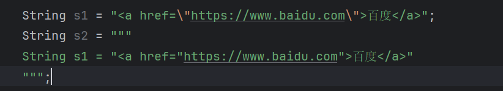
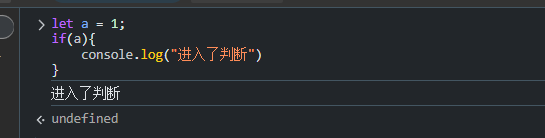

# JavaScript

## 入门

js就是脚本文件，可以动态的修改html的内容。

```html
<!DOCTYPE html>
<html lang="en">
<head>
    <meta charset="UTF-8">
    <meta name="viewport" content="width=device-width, initial-scale=1.0">
    <title>js入门</title>
</head>
<body>

    <p id="p1">11111</p>
    
</body>
</html>
```

修改  1111 --> 2222


代码

```html
<!DOCTYPE html>
<html lang="en">
<head>
    <meta charset="UTF-8">
    <meta name="viewport" content="width=device-width, initial-scale=1.0">
    <title>js入门</title>
</head>
<body>

    <p id="p1">11111</p>
    <script>
        document.getElementById("p1").innerText="3333"
    </script>
</body>
</html>
```

## 变量与数据类型

变量声明

* let

```js
let 变量名 = 值;

let a = 10;
a  = 200;
```

let 声明的变量可以多次被赋值

* const

```html
const b =  100;
b = 500; // error  不能再次赋值
```


```javascript
const c = [1,2,3]
c[2] = 4  // 可以赋值，常量就是地址不能边
```


* var

var 可以被多次赋值，能用let 就用let。

基本类型

* undefined 和null

**函数没有返回值** 就是 undefined,或者打印**对象**不存在的属性，或者声明的变量没有赋值，要是打印不存在的变量就报错


undefine 都是js才产生的，null是我们自己设置的（后端响应）。


3）string

```html
<a href="https://www.baidu.com">百度</a>
```

用java和 JavaScript 串来表示上述字符串

java

```java
String s1 = "<a href=\"https://www.baidu.com\">百度</a>"   //转义
  String s2 = """
        String s1 = "<a href="https://www.baidu.com">百度</a>"
        """; // 8以上的才支持
```




JavaScript

```javascript
let s1 = '<a href="https://www.baidu.com">百度</a>'

let s3 =`<a href="https://www.baidu.com">百度</a>`
```


模板字符串

需求拼接 URI的请求参数

```txt
/test?name=li&age=20
/test?name=liu&age=21
```

传统方法拼

```javascript
let name = "li"
let age = 20
let uri = "/test?name=" +name + "&age=" +age
```


模板字符串拼接

```javascript
let name = "li"
let age = 20

let uri = `/test?name=${name}&age=${age}`
```


4） number 和bigint

 number 浮点数


类型转换

```javascript
parseInt(10.0000) #10

parseInt(10.05) #10

parseInt(10.05) /3 #3.3333333333333335


parseInt("10.0000") #10
"50" -0
50
"10.5"-0
10.5
("10.5"-0) /3
3.5

parseInt("ssada") #NaN
```


bigint 正数

数字+n 例如 10n


6)boolean

```javascript
let a = 1;
if(a){
    console.log("进入了判断")
}
```




java就不行


* Truthy
* Falsy

当需要条件判断时，这个值，被当作true 的值归为Truthy，否则Falsy


Falsy

* false
* nullish(null,undefined)
* 0 ,0n,Nan
* "",'',Nan


## 对象类型

1）Function

定义

```javascript
function 函数名（参数）{
    // 函数体
    return 结果；
}
```


例子

```javascript
function add(a,b){
    return a +b;
}
```

函数调用

```函数名（实参）```


和Java相比，定义函数的时候，不需要定义类型，当然参数也可以是任意类型。

在调用的时候，参数的类型不固定，甚至数量也不固定


* 默认参数

Java中默认参数

@RequestionParam(defaultValue="1")

js

```javascript
function pagenation(page = 1,size = 10){
    console.log(page,size)
}
```


* 匿名函数

语法

```js
(function (参数){
    //函数体
    return xx;
})
```

例子

```js
(function (a,b){
    return a + b;
})
```

怎么调用呢?没有名字

使用场景,

只调用一次,之后就不用了就在其后面添加参数

```js
(function (a,b){
    return a + b;
})(1,2)
```

作为其他对象的方法

```js
document.getElementById("p2").onclick = (function (){
    console.log("鼠标点击")
})
```


 

* 箭头函数

语法

```js
(参数) => {
    //语句
}
```

如果只有一个参数 ()可以省略

如果只有一个语句,{}可以省略


* 函数是对象

1.函数也可以赋值,

```js
function adb(){
    console.log("abc");
}
document.getElementById("p1").onclick = abc
```

2.函数是对象---有属性,有方法

```js
function adb(){
    console.log("abc");
}

console.dir(adb)
```


带f 的是方法,不带的是属性,[[]]是内置属性

3.可以作为方法的参数

```js
function a(){
    console.log(a);
}
function b(fn){    //fn 表示函数类型的对象
    console.log(b);
    fn();           //调用函数对象
}
```


4. 作为方法的返回值

```js
function c(){
    console.log("c")
    function d(){
        console.log("d")
    }
    return d;
}
c
c()()
```


* 作用域

  函数可以嵌套

  ```js
  function a(){
      functionb(){
          
      }
  }
  ```

  例子

  ```js
  function c(){
      var h = 30;
  }
  var z = 50
  function a(){
      var y = 20;
      function b(){
          var x = 1var
          console.log()
      }
      b();
  }
  a();
  // a执行调用b.b可以访问的参数，x,y,z. 不能访问h。
  
  ```

* 闭包

```js

var x = 50
function a(){
    var y = 20;
    function b(){
        var x = 1var
        console.log(x,y)
    }
    return b;
}
a()(); // a()返回b,b()，b调用b,能取得元素吗，额可以

```

函数定义时，作用域已经确定好了， 因此无论函数将来在那个范围，都可以从他的作用域中找到变量


2）数组

语法

```js
let arr = [1,2,3]
arr[0]
a[0] = 5
arr.length
for(let i = 0 ;i < arr.length; i++){
    console.log(arr[i])
}

```

API

* push shift splice

```java
let arr = [1,2,3]
arr.push(4)  // 返回值是4，在数组的尾部添加4 元素
arr.shift()  // 返回值是数组开头元素，将元素开头剔除
arr.splice(起点,删除个数)  
```

* join

```js
let arr = ['a','b','c'];
arr.join() //"a,b,c"默认是，连接
arr.join("_") // 可以指定连接方式
```


* map,filter,foreach

 [1,2,3,5]   => [10,20,30,50]

```js
let arr = [1,2,3,5]
for(let i = 0; i < arr.length; i ++){
    arr[i] = a[i] *10;
}

function add(i){
    return i * 10
}
arr.map(add)
arr.map((i) =>{return i *10});
arr.map(i =>return i *10);

```

filter   [1,2,3,4,5,6,7,8]   => [1,3,5,7]

```js
let arr =  [1,2,3,4,5,6,7,8]
for(let i = 0 ; i < arr.length; i ++){
    if(arr[i]%2 == 0){
        arr.splice(i,1)
        i--
    }
}
arr.filter((i)=>{return i%2})
arr.filter(i=>  i%2 )
```

foreach

```js
let arr = [1,2,3,4,5]
for(let i = 0; i < arr.length; i ++){
    console.log(arr[i])
}

arr.forEach((i)=> console.log(i))
```


tips: map，filter，不会改变原数组，。

高阶函数，函数接收函数作为参数 map,filter,forEach

回调函数，最为函数参数的函数

3）Object

语法

```js
let obj ={
    属性名：值,
    方法名：值,
    get 函数名(){},
    set 函数名（）{}
}
```

例子

```js
let user ={
    name:"hnsqls",
    age:20,
    study: function(){
        console.log(this.name +"正在学习 ")
    }
        
}
```

```js
let name = "hnsqls"
let age = 20
let study = function(){
    console.log(this.name +  "正在学习")
}
let stu =  {name,age,study}
```

```js
let user ={
    name:"hnsqls",
    age:20,
    study{
        console.log(this.name +"正在学习 ")
    }
        
}
```

get,set 方法

```js
let stu = {
_name:null,
get name(){
return this._name;
},
set name(name){
 this._name =name;
}
}
```

方法的调用和java 不一样


set 方法就是 直接赋值 name = "Xxx"

get 方法就是 直接名称name

对比一下java 的对象

* java 的Object类的模板，规定了属性，方法。
* js中的对象，属性，方法可以随时加减。

```js
let stu = {name:"hnsqls"}
console.log(stu)
stu.age =21
console.log(stu)

stu.study = function(){
    return this.age + this.name + "在学习"
}
console.log(stu)
stu.study()

delete stu.age
console.log(stu)
```


## 运算符表达式

1) ===

严格相等运算符，用作逻辑判断。

```'js
1 ==1     
1 == '1'
1=== '1'
```


2) ||

需求不传参数默认是男

```js
function sex(sex = '男'){
   console.log(sex);
}
```


或者写法

```js
function sex(gender){
    if(gender === undefined){
        gender = "男"
    }
    console.log(gender);
}
```

在或者

```js
function sex(gender){
 gender = (gender === undefined) ? "男" : gender;
  
 console.log(gender)
}
```

再或者

```js
function sex(gender){
    gender =  gender || '男';
    console.log(gender)
}
```

3） ？？与？.

需求：undefinde 或者是null 设置默认值

 ```js
function sex(gender){
   if(gender === undefined || gender === null){
       gender = '男'
   }
    console.log(gender)
}
 ```

```js
function sex(gender){
    gender = gender ?? '男'
    console.log(gender)
}
```

gender 不是nullish,就可以赋值，否则就默认。


?. `?.` 是可选链操作符，用于在访问对象的属性时避免 `undefined` 或 `null` 导致的错误

```js
const user = {
    profile: {
        name: "John"
    }
};
console.log(user.profile?.name); // 输出 "John"
console.log(user.address?.city); // 输出 undefined，但不会报错
```

4) ... 的使用

... 展开语法


展开数组

```js
let arr[] = [1,2,3,4]
let res[] = [...arr]
console.log(res)
```

```js
let a = [1,2,3,4]
let b = [9,8,7]

let res = [...a,5,6,... b]

console.log(res)
```

函数参数

```js
function sum(a, b, c) {
    return a + b + c;
}

const numbers = [1, 2, 3];
console.log(sum(...numbers)); // 输出 6
```


展开对象

```js
const obj1 = { a: 1, b: 2 };
const obj2 = { c: 3, d: 4 };
const merged = { ...obj1, ...obj2 };
console.log(merged); // 输出 { a: 1, b: 2, c: 3, d: 4 }
```

覆盖属性

```js
const obj1 = { a: 1, b: 2 };
const obj2 = { b: 3, c: 4 };
const merged = { ...obj1, ...obj2 };
console.log(merged); // 输出 { a: 1, b: 3, c: 4 }
```


5） []{}

解构赋值

[]

用在声明变量时

```js
let arr =[1,2,3]
let [a,b,c] = arr;
```

用在声明参数时

```js
let arr =[1,2,3]

function test(a,b,c){
    console.log(a,b,c)
}

function test([a,b,c]){
    console.log(a,b,c)
}
```


{}

用在声明变量时

```js
let obj = {name:"张三",age:18}
let {name,age} = obj;

```

用在声明参数上

```js
function test({name,age}){
    console.log(name,age)
}
```


## 控制语句

* if else
* switch
* while
* do while
* for 
* for ... in
* for .... of
* try catch


1) for ... in

用来遍历对象

```js
let father = {name:"hnsqls",age: 20}

for(const n in father ){
    console.log(n)
}
```

tips: const n  表示遍历出来的属性名称

​		方法名也能被遍历出来

​		遍历子对象时，父对象的属性也会跟着遍历出来

* 获取属性值要用[],而不能用.语法,也就是n只是名称

```js
for (const n in father){
    console.log(n,father[n])
}
```


2) for of

遍历数组

```js
let a = [1,2,3]

for(const i of a1){
    console.log(i)
}

let a2 = [
	{name:"hnsqls",age:18},
    {name:"hn",age:18},
    {name:"sq",age:18},
]

for (const obj of a2){
    console.log(obj.name,obj.age)
}
for (const {name,age} of a2){
    console.log(name,age)
}
```


## API

## 模块化

​	