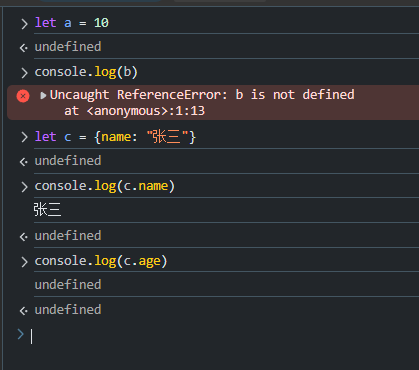

# JavaScript

## 入门

js就是脚本文件，可以动态的修改html的内容。

```html
<!DOCTYPE html>
<html lang="en">
<head>
    <meta charset="UTF-8">
    <meta name="viewport" content="width=device-width, initial-scale=1.0">
    <title>js入门</title>
</head>
<body>

    <p id="p1">11111</p>
    
</body>
</html>
```

修改  1111 --> 2222


代码

```html
<!DOCTYPE html>
<html lang="en">
<head>
    <meta charset="UTF-8">
    <meta name="viewport" content="width=device-width, initial-scale=1.0">
    <title>js入门</title>
</head>
<body>

    <p id="p1">11111</p>
    <script>
        document.getElementById("p1").innerText="3333"
    </script>
</body>
</html>
```

## 变量与数据类型

变量声明

* let

```js
let 变量名 = 值;

let a = 10;
a  = 200;
```

let 声明的变量可以多次被赋值

* const

```html
const b =  100;
b = 500; // error  不能再次赋值
```


```javascript
const c = [1,2,3]
c[2] = 4  // 可以赋值，常量就是地址不能边
```


* var

var 可以被多次赋值，能用let 就用let。

基本类型

* undefined 和null

**函数没有返回值** 就是 undefined,或者打印**对象**不存在的属性，或者声明的变量没有赋值，要是打印不存在的变量就报错



undefine 都是js才产生的，null是我们自己设置的（后端响应）。


3）string

```html
<a href="https://www.baidu.com">百度</a>
```

用java和 JavaScript 串来表示上述字符串

java

```java
String s1 = "<a href=\"https://www.baidu.com\">百度</a>"   //转义
  String s2 = """
        String s1 = "<a href="https://www.baidu.com">百度</a>"
        """; // 8以上的才支持
```


JavaScript

```javascript
let s1 = '<a href="https://www.baidu.com">百度</a>'

let s3 =`<a href="https://www.baidu.com">百度</a>`
```


模板字符串

需求拼接 URI的请求参数

```txt
/test?name=li&age=20
/test?name=liu&age=21
```

传统方法拼

```javascript
let name = "li"
let age = 20
let uri = "/test?name=" +name + "&age=" +age
```


模板字符串拼接

```javascript
let name = "li"
let age = 20

let uri = `/test?name=${name}&age=${age}`
```


4） number 和bigint

 number 浮点数


类型转换

```javascript
parseInt(10.0000) #10

parseInt(10.05) #10

parseInt(10.05) /3 #3.3333333333333335


parseInt("10.0000") #10
"50" -0
50
"10.5"-0
10.5
("10.5"-0) /3
3.5

parseInt("ssada") #NaN
```


bigint 正数

数字+n 例如 10n


6)boolean

```javascript
let a = 1;
if(a){
    console.log("进入了判断")
}
```


java就不行


* Truthy
* Falsy

当需要条件判断时，这个值，被当作true 的值归为Truthy，否则Falsy


Falsy

* false
* nullish(null,undefined)
* 0 ,0n,Nan
* "",'',Nan


## 对象类型

1）Function

定义

```javascript
function 函数名（参数）{
    // 函数体
    return 结果；
}
```


例子

```javascript
function add(a,b){
    return a +b;
}
```

函数调用

```函数名（实参）```


和Java相比，定义函数的时候，不需要定义类型，当然参数也可以是任意类型。

在调用的时候，参数的类型不固定，甚至数量也不固定


* 默认参数

Java中默认参数

@RequestionParam(defaultValue="1")

js

```javascript
function pagenation(page = 1,size = 10){
    console.log(page,size)
}
```


* 匿名函数

语法

```js
(function (参数){
    //函数体
    return xx;
})
```

例子

```js
(function (a,b){
    return a + b;
})
```

怎么调用呢?没有名字

使用场景,

只调用一次,之后就不用了就在其后面添加参数

```js
(function (a,b){
    return a + b;
})(1,2)
```

作为其他对象的方法

```js
document.getElementById("p2").onclick = (function (){
    console.log("鼠标点击")
})
```


 

* 箭头函数

语法

```js
(参数) => {
    //语句
}
```

如果只有一个参数 ()可以省略

如果只有一个语句,{}可以省略


* 函数是对象

1.函数也可以赋值,

```js
function adb(){
    console.log("abc");
}
document.getElementById("p1").onclick = abc
```

2.函数是对象---有属性,有方法

```js
function adb(){
    console.log("abc");
}

console.dir(adb)
```


带f 的是方法,不带的是属性,[[]]是内置属性

3.可以作为方法的参数

```js
function a(){
    console.log(a);
}
function b(fn){    //fn 表示函数类型的对象
    console.log(b);
    fn();           //调用函数对象
}
```


4. 作为方法的返回值

```js
function c(){
    console.log("c")
    function d(){
        console.log("d")
    }
    return d;
}
c
c()()
```


* 作用域


## 运算符表达式

## 控制语句

## API

## 模块化

