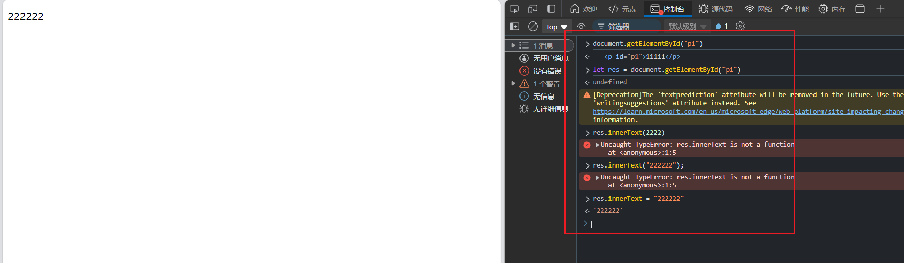

# JavaScript

## 入门

js就是脚本文件，可以动态的修改html的内容。

```html
<!DOCTYPE html>
<html lang="en">
<head>
    <meta charset="UTF-8">
    <meta name="viewport" content="width=device-width, initial-scale=1.0">
    <title>js入门</title>
</head>
<body>

    <p id="p1">11111</p>
    
</body>
</html>
```

修改  1111 --> 2222



代码

```html
<!DOCTYPE html>
<html lang="en">
<head>
    <meta charset="UTF-8">
    <meta name="viewport" content="width=device-width, initial-scale=1.0">
    <title>js入门</title>
</head>
<body>

    <p id="p1">11111</p>
    <script>
        document.getElementById("p1").innerText="3333"
    </script>
</body>
</html>
```

